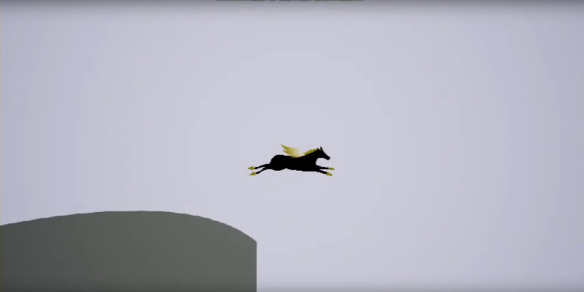
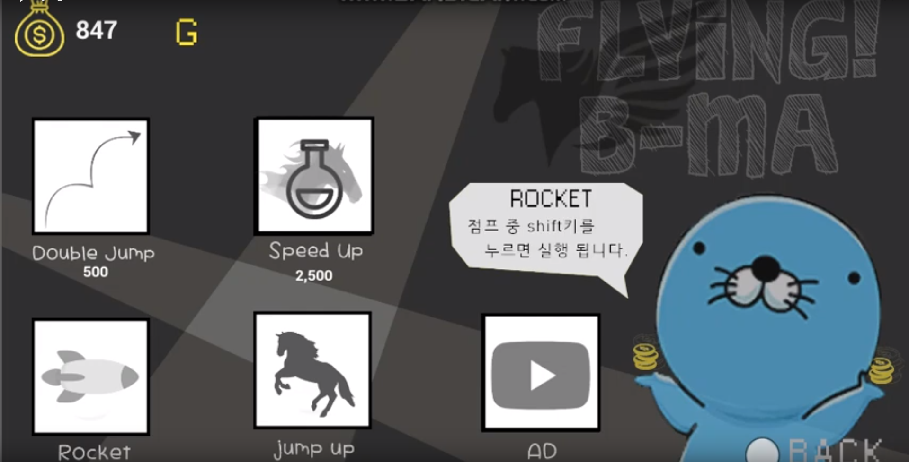

# Flying-B-MA
광운대학교 소프트웨어학부 소모임 PU에서 진행한 학술제에서 발표한 작품입니다.

비마(말)가(이) 언덕 위에서 뛰면 거리에 비례한 점수와 골드를 얻습니다.

획득한 골드를 이용해 아이템을 사거나 능력치를 증가시킬 수 있습니다.  (30초 광고를 보면 3000골드를 얻을 수 있습니다.)

시연 동영상 : https://youtu.be/i6XWGguKZM8

프로젝트 파일 및 실행파일 : https://1drv.ms/f/s!AtsqcOwlyTnliFXGhrzPPq0G6l2a 

개발 기간 : 2018-11-12 ~ 2018-11-23 (12일)  
개발 인원 : 3명 (개발자 1명, 기획자 1명, 디자이너 1명)   
사용 도구 : Unreal Engine
